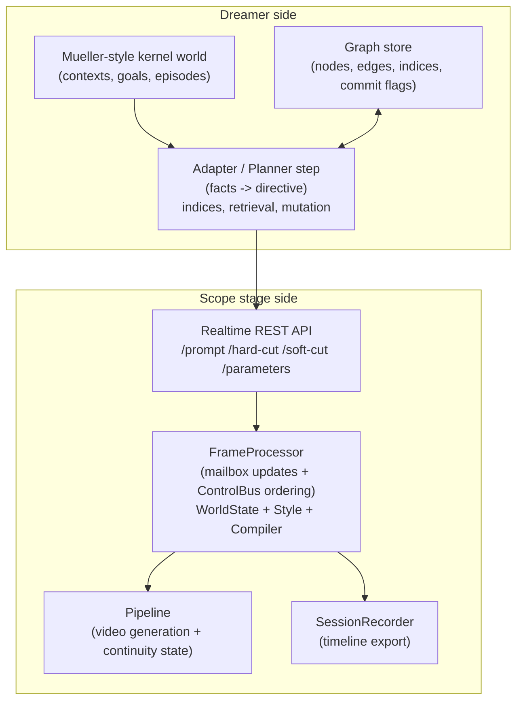
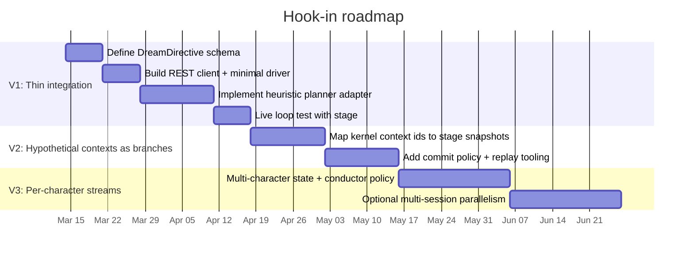

# Fresh integration plan for a DAYDREAMER-style concern-control-goal-context loop in your codebase

## Executive summary

Your codebase already contains two complementary halves of a Mueller-style architecture:

In **latent-dreamer**, you have a Clojure “daydreamer-kernel” that already implements the hard-to-fake parts of Mueller’s architecture: a mode-oscillating control loop, top-level goal competition, explicit context sprouting and pseudo-sprouting, backtracking over context trees, and threshold-based episodic retrieval with serendipity.  

In **scope-drd**, you have a real-time “stage” with a deterministic, chunk-boundary control plane (ControlBus), a validated WorldState model, prompt compilation, and a REST “realtime control API” that can accept prompt updates, hard/soft cuts, and parameter bundles that are applied deterministically in FrameProcessor.  

The clean “fresh start” move is to treat the stage as a deterministic actuator and treat Mueller’s loop as an upstream decision-and-memory engine that emits small, explicit directives. Concretely:

- **V1 thin integration (recommended):** implement a Dreamer “bridge” process (in latent-dreamer or as a lightweight scope-drd script) that runs the kernel (or a kernel-inspired adapter), and drives Scope only through the existing realtime REST endpoints by sending a stable directive payload (prompt, transition policy, world-state patch, seed/branch hints, and cut policy). This requires minimal changes to scope-drd because FrameProcessor already has the right control semantics. 

- **Roadmap to full per-character streams:** once V1 is stable, promote “hypothetical contexts” to first-class branches that are not just cognitive, but also connected to Stage snapshots (FrameProcessor snapshot/restore) and seed offsets, enabling explicit exploration and commit policies per character. 

The primary risks are not technical difficulty, but semantic mismatches: what a “context” means in Mueller versus what a “branch” means in the diffusion pipeline, and what it means to “commit” something to canon versus merely rendering it. The plan below makes those mismatches explicit and designs the smallest stable API contracts that let you iterate safely.

## Current repo architecture and data models

### latent-dreamer: kernel plus design/spec surface

The repo root and daydreaming notes position latent-dreamer as an exploration and integration workspace, including a “daydream-to-stage contract” and broader conducted-daydreaming architecture notes.  

More importantly (and easy to miss if you only read the repo-level README), latent-dreamer contains a **kernel/** subtree with a defined stack and locked data-shape discipline: JVM Clojure, pure functions over a single threaded `world` map, and explicit schemas for contexts, goals, and episodes. 

The “world” state and its primary maps are documented explicitly in kernel guidance: contexts, goals, episodes, emotions, needs, mode, cycle, and a trace log. 

### scope-drd: stage runtime, control plane, and style layer

Scope-drd’s top-level README describes an end-to-end system (client, server, pipeline, UI/controls), and the documentation set includes a server API, a WebRTC pipeline interface, and parameter update mechanisms.  

From an integration standpoint, the most important architectural units are:

- **FrameProcessor** (server-side real-time loop): drains mailbox-style parameter updates, converts some updates into ordered events, applies them deterministically at chunk boundaries, calls the pipeline, and optionally records a timeline. It also contains a style layer: `WorldState`, `StyleManifest`, a compiler selected by style, and compiled prompt injection. 

- **ControlBus** (ordering semantics): provides the deterministic ordering policy (“apply at chunk boundary”) you want for a daydreamer-driven system that must not tear the stage state mid-chunk. 

- **WorldState model**: a typed model for the semantic state of the scene, including characters and high-level “action”/emotion fields that can be compiled into prompts. 

- **Realtime REST control endpoints**: scope-drd’s server layer provides endpoints for prompt changes and parameter updates that directly feed FrameProcessor’s update pipeline. 

### Assumptions and unknowns that affect the integration plan

The repos do not fully specify the following in the files examined, so the plan treats them as assumptions and keeps contracts abstract:

- Exact deployment topology for scope-drd (single host vs distributed, GPU locality, whether Dreamer can run on same machine). 
- Whether the kernel is intended to run as a long-lived service (nREPL exists, but no production server is described). 
- The current “episode store” and “dream graph” schema you actually want to drive during performance (several docs refer to palette/daydream assets that are not present in scope-drd’s current content tree). 

## Where DAYDREAMER logic exists today and what is missing

### What you already have that is genuinely Mueller-shaped

The documented origin system, developed by Erik T. Mueller at UCLA, with Michael G. Dyer, is described as implementing daydreaming goals, emotional control, hierarchical planning, episode indexing and retrieval, serendipity, and action mutation. 

Your kernel directly targets those same “load-bearing” mechanisms:

- A modeful control loop with need/emotion decay, selection among runnable goals, and switching between performance and daydreaming modes. 
- Explicit goal objects with planning-type distinctions and context pointers. 
- Context sprouting, inheritance, and pseudo-sprouting (critical for “alternative past” manipulation). 
- Coincidence-counting episodic retrieval with thresholds, recency suppression, and reminding cascades, including serendipity via effective threshold lowering. 
- Goal-family bodies (reversal, roving, rationalization) that mutate the context tree and emotional facts rather than merely changing labels. 

The “Goals and Control walkthrough” in kernel docs explicitly calls out the real-versus-imaginary planning distinction and the behavioral oscillation as a major gap in simplified engines. 

### Where DAYDREAMER logic currently exists in your repos

In latent-dreamer, the DAYDREAMER-style logic is concentrated in:

- `kernel/src/daydreamer/control.clj` (scheduler, mode oscillation, backtracking scaffolding). 
- `kernel/src/daydreamer/context.clj` (context graph, sprout/pseudo-sprout, assert/retract). 
- `kernel/src/daydreamer/goals.clj` (goal objects, activation policy, competition filter by mode). 
- `kernel/src/daydreamer/episodic_memory.clj` (threshold retrieval and reminding cascade). 
- `kernel/src/daydreamer/goal_families.clj` (plan bodies that perform context-copy pseudo-sprout and emotion diversion). 

In scope-drd, “DAYDREAMER logic” exists only as stage-facing primitives and semantic infrastructure:

- A deterministic control plane (ControlBus) and ordered application at chunk boundaries (FrameProcessor). 
- A semantic world-state data model suitable for “what the scene is about” and character state. 
- Prompt compilation and style swaps that can turn a semantic state into actual pipeline prompts. 
- REST endpoints intended specifically for agent/CLI control. 

### The biggest gaps between Mueller’s model and the current integrated runtime

These are the practical gaps you must bridge to get from the kernel’s “Mueller-faithful” loop to a live conducted instrument:

1. **Planner step vs stage step mismatch:** the kernel currently provides a control cycle and context mutation primitives, but it does not define a live “what to render next” planner that maps context facts to a concrete audiovisual directive. This is acknowledged in the runner’s “scripted harness” framing. 

2. **Material store mismatch:** several notes assume a palette/daydream asset hierarchy and a “dream graph” with indices. Scope-drd’s current `content/` tree is oriented toward playlists, not daydream graphs, so the material substrate likely needs to be added or moved. 

3. **Hypothetical context vs diffusion branch mismatch:** Mueller contexts are symbolic inherited fact sets; Scope branching (snapshot/restore, seed offsets, transition bias) is generator-state and output continuity. You need explicit contracts that say when a “hypothetical context” also implies a stage snapshot, and when it does not. 

4. **Commit semantics are not yet encoded:** Mueller has termination semantics that can write back into “reality context”; Scope has world-state compilation plus timeline recording, but no explicit “canon commit policy” layer. You need to add one at the Dreamer level with a clearly bounded surface area on the stage side. 

## Mapping the concern-control-goal-hypothetical-context loop to concrete integration points in Scope

### The loop you are trying to map, in operational terms

A useful “fresh start” abstraction is to define the loop by what it must read and what it must emit:

- **Concern state (inputs):** needs, emotions, and situation pressures. In your kernel, these are explicit maps plus fact sets inside contexts, and goal-family activations are triggered by negative-emotion plus failure structure. 

- **Control (selection policy):** the scheduler does decay and selects the strongest runnable top-level goal, respecting mode filters. 

- **Goal (what kind of thought to do):** goal objects carry planning-type and motivational links, and in the kernel, goal families produce structurally different planning branches (reversal pseudo-sprouts; roving retrieval cascades; rationalization reframe facts and emotion diversion). 

- **Hypothetical contexts (state evolution space):** sprouted contexts represent alternatives; pseudo-sprouts represent “attached” counterfactual copies; backtracking chooses among remaining sprouts. 

To “hook into” Scope, the critical design decision is: what does the loop emit each cycle such that the stage can render it deterministically?

Scope already has a stable concept of a render directive: a prompt update (possibly with transition) plus parameter updates applied at a chunk boundary, optionally driven by a semantic WorldState that can be compiled to prompts. 

### Concrete integration points in scope-drd

The lowest-friction integration points are:

1. **Realtime control REST endpoints** in the server app, which exist explicitly to allow external control. These endpoints feed updates into FrameProcessor rather than requiring you to become a WebRTC client. 

2. **FrameProcessor reserved keys** that already implement “agent-style” semantics:
  - `_rcp_world_state` to replace the WorldState via validation.
  - `_rcp_set_style` to swap style manifests and optionally trigger cache reset plus LoRA updates.
  - `_rcp_soft_transition` to temporarily alter cache bias for soft changes.
  - `_rcp_snapshot_request` / `_rcp_restore_snapshot` for stage-level branching.
  - `_rcp_session_recording_start` / `_rcp_session_recording_stop` for timeline recording. 

3. **ControlBus deterministic ordering** guarantees that if your Dreamer emits multiple control intents within a cycle, the stage applies them in a predictable order at chunk boundaries (pause/resume, prompt, seed, etc.). 

### Component interaction diagram



This diagram matches the actual control-plane decomposition: Dreamer emits deterministic “directives,” Scope applies them at chunk boundaries, and the pipeline remains an implementation detail behind FrameProcessor.  

### Candidate integration designs

| Candidate design | What it is | Pros | Cons | Best use |
|---|---|---|---|---|
| Stage-driven, Dreamer as REST client (recommended V1) | Dreamer runs externally and only calls Scope realtime REST endpoints | Minimal scope-drd changes; uses existing deterministic application semantics; easy to iterate on Dreamer logic | Requires a stable directive schema; you still need a planner adapter that maps kernel facts to prompts/world updates | First live hook-in; fastest to working system |
| Dreamer embedded inside scope-drd | Put Dreamer loop inside scope-drd server process, calling FrameProcessor directly | Less network glue; single process coordination; lower latency | Couples cognitive experimentation to stage runtime stability; harder to iterate; harder to run offline comparisons | After V1 stabilizes, if you need microsecond-level control loops |
| Offline Dream plan export + playback | Kernel generates a directive timeline file; Scope consumes it like a playlist | Very stable; aligns with kernel’s “pure snapshots” and trace exports; good for comparisons | Not interactive; hard to “conduct” in real time; commit policy is offline only | Research runs, regression baselines, content generation |

## Minimal API contracts and data schemas for a V1 hook-in

### The minimal contract should be “directive in, deterministic stage change out”

Scope already accepts prompt updates, transitions, and parameter bundles that are applied safely at chunk boundaries. 

So the V1 contract should be:

- Dreamer produces a **DreamDirective** every cycle (or every N chunks).
- Dreamer sends it to Scope via one REST call (preferably the “parameters” endpoint so you can include reserved keys).
- Scope applies it deterministically at the next chunk boundary and returns an acknowledgment (HTTP 200 plus optional metadata).

This keeps the stage side “dumb” and avoids leaking Mueller-kernel concepts into scope-drd.

### Proposed DreamDirective schema

This schema is intentionally aligned to what FrameProcessor and ControlBus already process: `prompts`, `transition`, style/world-state reserved keys, and a few runtime parameters. 

```json
{
 "cycle_id": "2026-03-14T03:12:45.123Z#000412",
 "dreamer": {
  "mode": "daydreaming",
  "selected_goal": {"goal_type": "reversal", "planning_type": "imaginary", "strength": 0.78},
  "context_id": "cx-19",
  "active_indices": ["situation:s1_seeing_through", "goal:reversal", "emotion:negative"],
  "retrieved": [{"episode_id": "ep-27", "marks": 2, "threshold": 2, "serendipity": false}],
  "commit_policy": {"kind": "defer", "requires_confirm": true}
 },
 "stage": {
  "prompts": [{"text": "…", "weight": 1.0}],
  "transition": null,
  "reset_cache": false,
  "_rcp_soft_transition": null,
  "_rcp_set_style": "noir-v3",
  "_rcp_world_state": {
   "setting": "Backstage hallway",
   "action": "hesitation",
   "characters": [{"name": "Puppet", "emotion": "anger", "intensity": 0.7}]
  },
  "base_seed": 123456789,
  "denoising_step_list": [999, 950, 900],
  "kv_cache_attention_bias": 0.35
 }
}
```

Notes:
- The `dreamer` block is “for you,” not for Scope. It exists so you can log and debug the cognitive loop and so the same directive stream can later be replayed or compared to kernel traces. Kernel “trace export” is already treated as a major output. 
- The `stage` block is the only part Scope must understand. All keys used here map to FrameProcessor update paths. 

### Minimal function signatures

These are the smallest stable seams that let you swap implementations behind them:

```python
# Dreamer side: planner step surface
def dreamer_step(world, graph_store, now_ts) -> tuple["DreamDirective", "DreamerState"]:
 ...

# Dreamer side: stage client
class ScopeRealtimeClient:
  def apply_parameters(self, params: dict) -> dict:
    """POST to /api/v1/realtime/parameters (or equivalent).
    Returns ack metadata (chunk index, current prompt, etc.) when available."""
   ...
```

On the kernel side, you already have the pure “world threaded through cycle” convention, so the adapter layer can remain an edge that turns kernel state into a directive without changing kernel internals. 

### Required changes per repo (V1)

| Area | latent-dreamer changes | scope-drd changes |
|---|---|---|
| Stable directive schema | Add a `DreamDirective` schema definition (JSON + EDN), plus an exporter from kernel trace/world snapshots | None required if using existing “parameters” update entrypoint |
| Planner adapter | Implement facts/indices -> prompt/world-state selection (initially heuristic, later LLM-assisted offline) | None |
| Graph store | Add storage for nodes, edges, indices, and commit flags (see performance section) | None |
| Stage client | Implement REST client that submits `_rcp_*` keys, prompts, and cut policies | None; endpoints already exist |
| Optional ack channel | If you want Dreamer to receive snapshot IDs or timeline paths, add a simple response convention | Possibly minor: expose snapshot response callback via REST response or polling endpoint (optional) |

## Migration plan from thin integration to full per-character streams

### V1 thin integration (one stream, deterministic stage control)

V1 is about proving a tight loop where each Dreamer cycle yields a visible stage change without tearing the generator state:

- Treat each Dreamer cycle as a “chunk boundary decision.”
- Emit either:
 - a prompt transition (soft or hard), or
 - a world-state update that triggers compiled prompt injection (when no explicit prompt is provided). FrameProcessor already supports “compile if world-state updated and no explicit prompts were set.” 
- Use ControlBus ordering implicitly through FrameProcessor; do not try to coordinate multiple stage calls per cycle until you have evidence you need it. 

### Roadmap to per-character streams (Mueller contexts as multiple competing “minds”)

A per-character stream roadmap is feasible because WorldState already contains character state, and the kernel already supports multiple goals and contexts. 

The key is to not jump immediately to “N kernels.” Instead:

- **Phase A (single kernel, multi-character state):** represent per-character concerns as fact subsets and emotion facts, but keep one global goal competition. Output directives still produce one unified prompt/world-state per chunk.

- **Phase B (per-character context trees, shared stage):** maintain independent context trees per character (or per “narrative agent”), but add one conductor policy that selects which character’s directive controls the stage at the next chunk boundary (for example, “highest arousal,” or “most unresolved failed goal”). This mirrors goal competition at a higher level.

- **Phase C (true parallel streams):** only if you need it, run multiple Scope sessions or multiple pipelines, each controlled by a per-character Dreamer stream. This is the point where compute and UX become the gating constraints, not architecture.

### Timeline sketch



This ordering follows the kernel’s own documented discipline: prove value with bounded integration, then port deeper machinery only when you can demonstrate it produces useful behavior. 

### Prioritized implementation checklist with effort

| Priority | Step | Effort | Why |
|---|---|---|---|
| P0 | Lock a DreamDirective schema and log format | Low | Prevents thrash; aligns kernel trace export goals with stage control |
| P0 | Implement a Scope realtime REST client that only uses “parameters” updates | Low | Lets you drive prompts, world state, style, and cuts through one deterministic entrypoint |
| P1 | Build a minimal planner adapter: facts/indices -> prompt + world patch | Med | This is the missing “run one planning step” bridge from kernel to stage |
| P1 | Implement an inverted index for episodes/nodes (threshold retrieval) | Med | Matches the kernel’s retrieval mechanics, avoids expensive scans |
| P2 | Add commit policy enforcement (defer vs commit) | Med | Needed to keep “hypothetical” explorations from corrupting canon |
| P2 | Wire stage snapshot/restore into Dreamer “branch” operations | High | Powerful, but memory-heavy; do after V1 proves the loop |
| P3 | Per-character conductor policy | High | Only worth doing after single-stream shows stable “return/drift/hold” dynamics |

## Testing, performance, commit policy, and risks

### Testing strategy across kernel, adapter, and stage

A robust strategy is layered:

1. **Kernel golden tests (already aligned with repo discipline):** the kernel already emphasizes invariants and tests for sprouting, pseudo-sprouts, and retrieval behavior. Extend this by adding golden “cycle traces” for a small fixture world, since the kernel’s major output is trace comparability. 

2. **Adapter determinism tests:** given a fixed kernel world snapshot and a fixed graph store, the adapter must produce the same directive. This prevents “LLM drift” from becoming a hidden dependency. The kernel’s emphasis on pure data and replayability makes this straightforward. 

3. **Stage contract tests at the REST boundary:** scope-drd already has tests for control-plane components (ControlBus, generator driver) and FrameProcessor has deterministic ordering behavior. Add a minimal integration test that:
  - posts a parameters update containing `_rcp_world_state` and verifies that prompts were compiled when no explicit prompts were set,
  - posts a prompt update with transition and verifies the transition lifecycle, and
  - posts hard cut and confirms `reset_cache` is applied once and queues are flushed. 

### Performance and storage considerations for the graph store

The kernel’s episodic retrieval design implies a specific storage and indexing shape: “episodes stored under multiple indices” and retrieval by coincidence counting over active indices. 

A practical graph store design that matches this without overengineering:

- **Core tables/collections:**
 - Nodes: `{node_id, payload, indices[], created_at, commit_state}`
 - Edges: `{from_id, to_id, edge_type, weight, created_at}`
 - Inverted index: `index_string -> set(node_id)` (or a DB index table)

- **Retrieval:** given a set of active indices, compute candidate nodes by counting overlaps. In-memory maps are fine up to tens of thousands of nodes. If you need persistence and scale, SQLite with an `indices(node_id, index)` table plus composite index works well.

- **Write amplification control:** store payloads as immutable JSON blobs and keep “world-state” deltas separate. This aligns with the kernel’s “persistent snapshots” mindset and makes replay and diffing easy. 

- **Stage snapshot memory risk:** FrameProcessor snapshots clone GPU tensors and keep an LRU store (default max 10). If you decide to map “hypothetical contexts” to stage snapshots, you must treat snapshot count and tensor sizes as a strict budget, or you will crash the stage with GPU memory pressure. 

### Commit policy implementation options

A commit policy is the missing bridge between “hypothetical thought” and “canon.” Mueller has termination semantics that can write back to a reality context; your kernel already mirrors a “reality-context sprout after termination” idea. 

In your conducted instrument, you likely want a clearer separation:

**Option A: Manual commit (safest for live performance)**
- Dreamer emits candidate events and world-state edits as “proposals.”
- Commit requires explicit operator action (MIDI button, UI toggle, or a “commit” endpoint).
- Stage always renders proposals, but the canonical world state in Dreamer only changes on commit.

**Option B: Threshold commit (Mueller-flavored, semi-automatic)**
- An event becomes commit-eligible after repeated retrieval or repeated selection (for example, the same “proposal fact” appears in K contexts or is selected N times without backtracking).
- Mirrors the coincidence-counting flavor of episodic retrieval. 

**Option C: Outcome-based commit (termination semantics)**
- Commit happens only when a goal terminates as succeeded (or stabilized), and the commit payload is derived from the termination context facts.
- This most closely matches Mueller’s notion that resolution contexts can write back. 

In V1, Option A is the most robust because it prevents “runaway canon drift” while you tune the planner adapter. In V2, move toward Option C for specific goal families (for example, rationalization success commits an “emotional reinterpretation” fact, reversal success commits a “counterfactual admitted” fact), because your kernel goal-family bodies already produce those structured manipulations. 

### Risks and mitigations

**Risk: Conflating cognitive contexts with generator branches**
- Symptom: you try to map every kernel sprout to a stage snapshot, exploding memory and coupling thought branching to GPU state.
- Mitigation: only create stage snapshots at explicit “exploration points” (for example, when Dreamer intends to audition alternatives), and keep most contexts purely symbolic. Use stage snapshots as an optimization for reversible rendering, not as the definition of a context. 

**Risk: No stable “planning step” abstraction**
- Symptom: you keep rewriting the adapter between kernel facts and stage prompts.
- Mitigation: lock the DreamDirective schema early and enforce determinism tests: (kernel snapshot, graph snapshot) -> directive. This turns planner churn into versioned, testable behavior. 

**Risk: Material substrate drift across repos**
- Symptom: notes refer to palette/daydream content not present in scope-drd; you waste time chasing file layout.
- Mitigation: treat “episode store” as an interface, not a directory. Define an `EpisodeProvider` that can back onto playlists first (since scope-drd clearly supports those), then add a separate daydream content root when ready. 

**Risk: Over-trusting external summaries of DAYDREAMER**
- Symptom: you implement a “DAYDREAMER-inspired” loop that loses the load-bearing pieces (mode oscillation, explicit context inheritance, coincidence retrieval).
- Mitigation: anchor all key mechanics to (a) the kernel’s recovered implementations and guardrails, and (b) primary descriptions of the original system’s capabilities (for example, the AI repository description and the reference to the 1985 papers and the 1990 book Daydreaming in Humans and Machines: A Computer Model of the Stream of Thought). 

**Risk: Stage control races**
- Symptom: Dreamer spams parameter updates and causes nondeterministic visual transitions.
- Mitigation: enforce one directive per chunk boundary, rely on FrameProcessor’s mailbox merge, and only use ControlBus ordering for multi-intent directives (pause + prompt + cut). This matches the stage’s designed semantics. 