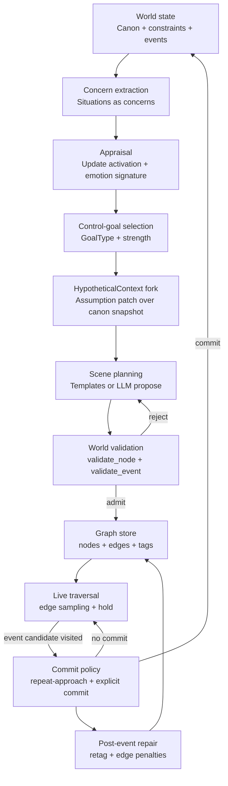
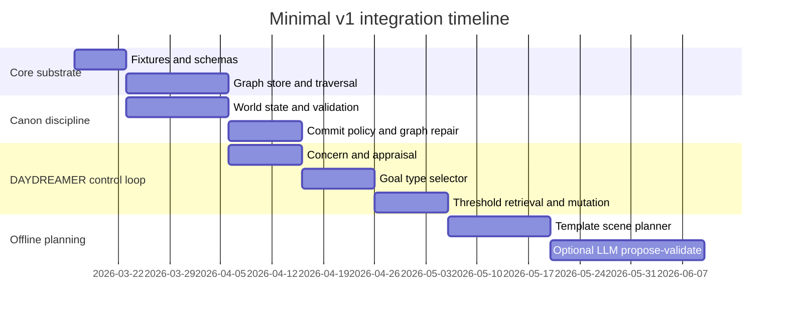
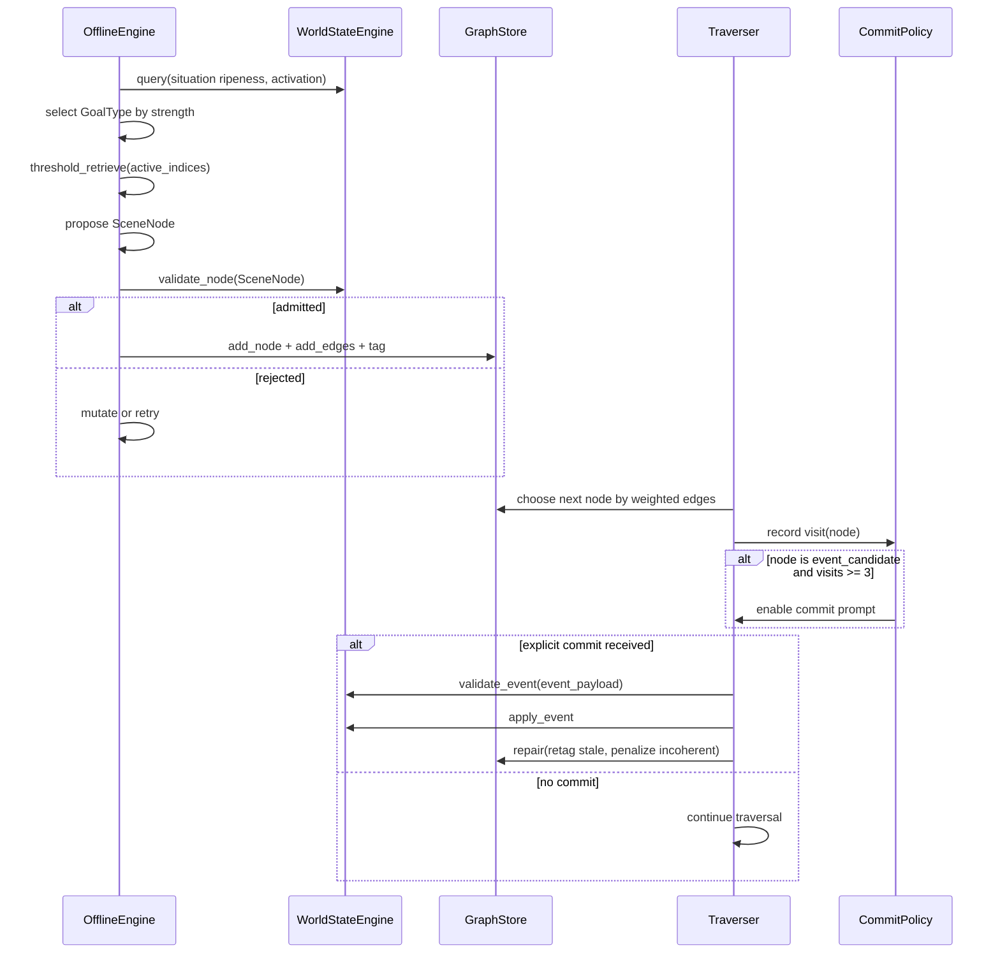

# Integrating Mueller’s DAYDREAMER Control Loop into the latent-dreamer Repository

## Executive summary

The `davidrd123/latent-dreamer` repository is currently a design workspace for the dream and narrative layer, not an implemented engine. It explicitly aims to sit on an existing real-time stage layer (Scope video plus Lyria audio) from a previous codebase, instead of rebuilding renderers.

Within `latent-dreamer`, the strongest, most operational architectural baseline is the v2 spec. It defines a four-layer system (World, Cognitive, Graph, Stage) and a pipeline that separates offline generation from live traversal. Canonical world state stays separate from counterfactual daydream material, and canonical state advances only at explicit event commits.

Mueller’s 1985 work (and the later system described in the DAYDREAMER lineage) is best integrated here as a control policy for offline graph expansion, not as a surface text generator. The 1985 paper frames daydreaming as supporting plan preparation and rehearsal, learning from failures and successes, creativity, emotion regulation, and motivation. The repo’s own “focused source trace” and “working spec” argue that the load-bearing parts to port are: (a) the repeated short-cycle scheduler, (b) competing daydream goal types, (c) coincidence-count episodic retrieval, (d) structured mutation as stuckness handling, and (e) explicit separation between real and imaginary processing contexts.

A minimal v1 integration plan, consistent with the repo’s “next slice” guidance, is to implement a small, hand-authored world bible plus a hand-authored dream graph plus a traversal harness that emits stage directives (DreamNode/DreamEdge) and a session log. Only after traversal feels like “return, drift, hold, counterfactual jump” should you invest in an offline generator loop that uses Mueller-style control goals to expand the graph.

## Repository findings and architectural intent

The repository’s README is explicit about scope and boundaries: it is a Round 03 workspace for the dream and narrative layer; the stage layer already exists elsewhere; and the repo currently contains (1) a `daydreamer/` directory referring to Mueller’s original Common Lisp implementation, (2) active design notes under `daydreaming/Notes/`, and (3) an empty scratch `patterns/` directory.

The “home base” note clarifies the implied porting strategy: treat Mueller’s code as architectural source material, not as product code, and treat the immediate bottleneck as missing executable fixtures and schemas (world bible fixture, dream graph schema, traversal harness, session log schema). It also calls out that several key operational terms (hold, ripeness, activation, attractor, edge weighting, and post-event repair rules) must be pinned down as code-level definitions rather than remaining evocative concepts.

The v2 spec frames the system as four layers, with the offline engine operating across World, Cognitive, Graph layers, and live performance operating across Graph and Stage layers. It also makes the “canon vs counterfactual” split a first-class structural commitment, with event commitment as the only canonical-state mutation path during traversal.

The “daydream-to-stage contract” concretizes what “integration with the stage” means for v0 and v1: emit `DreamNode` and `DreamEdge` objects (and a `DreamGraph` container) that reference tuned palette cells and carry a small “mind” and “world” payload plus minimal stage and audio directives. This contract is the correct seam for the narrative engine because it keeps live rendering independent of offline cognition and planning.

## Mapping latent-dreamer artifacts to the DAYDREAMER control loop

Mueller and Michael G. Dyer’s 1985 paper situates daydreaming as a cognitive control process guided by goals and emotions, and the paper explicitly treats “control goals” as strategies for what to daydream about (for example rationalization, reversal, revenge, preparation). The modern integration target in `latent-dreamer` is your stated pipeline: concern → appraisal → control-goal → hypothetical-context → scene planning → graph store → commit policy.

The table below links (a) that loop, (b) the repo artifacts that already specify each piece, and (c) the minimal code modules that would need to exist inside `latent-dreamer` for the loop to become executable.

| DAYDREAMER loop component | latent-dreamer current “source of truth” | What exists today | Concrete module to add in latent-dreamer |
|---|---|---|---|
| Concern | Situations with ripeness (slow pressure) and activation (session salience); canonical vs counterfactual split | Specified in v2 World Layer; reinforced in v1 interaction note | `world/situations.py` + `concerns.py` (derive concerns from world state and traversal history) |
| Appraisal | Update activation, select dominant situation, compute emotional signature, update after node generation and after commits | Specified as steps in v2 generation cycle; “hold” and activation dynamics need operationalization | `appraisal.py` + `activation.py` (deterministic updates from events and from “dwell”) |
| Control-goal selection | Daydream goal types (rationalization, roving, revenge, reversal, recovery, rehearsal, repercussions) as a first-class strategy selector | Heavily specified in v2 Cognitive Layer; Mueller triggers summarized in focused source trace and working spec | `control_goals.py` (GoalType enum + rule-based selector + strength computation) |
| Hypothetical context | Compatibility status, assumed facts, and the stated need to translate Mueller’s context tree into a navigable scene graph | Specified conceptually; translation step is acknowledged as “real structural work” | `hypotheses.py` (HypotheticalContext = base canon snapshot + assumption patch + provenance) |
| Scene planning | Offline propose → validate → admit; retrieval (embedding plus coincidence thresholds) and mutation fallback | Specified in v2 orchestration and generation cycle; contract for node emission in daydream-to-stage | `planner.py` + `retrieval/threshold.py` + `mutation.py` (typed node templates per goal type) |
| Graph store | Node schema, edge schema, compatibility tags, post-event repair policy | Specified in v2 Graph Layer; noted as missing fixture/schema in home-base | `graph/store.py` + `graph/schemas.py` + `graph/repair.py` (JSON serialization, stats, retagging) |
| Commit policy | Repeated approach plus explicit confirmation; apply_event mutates canon; post-event repair retags nodes | Specified in v2 Stage Layer and v1 interaction note (events as canonical mutations) | `commit.py` (CommitPolicy + EventRouter + repair trigger) |
| Stage emission seam | DreamNode contract: palette references, “mind/world/stage/audio/narration” payload | Explicitly specified as the boundary contract | `stage/translator.py` (SceneNode → DreamNode; enforce “renderable without LLM”) |

### Component interaction diagram



This diagram matches the repo’s asserted split: offline engine writes the graph; live traversal reads the graph; canonical world state is consulted and mutated only at commitment.

## Gaps and refactor points with concrete interfaces and schemas

### Gap: latent-dreamer is specification-heavy but fixture-poor

The repo explicitly calls out missing executable artifacts: no world bible fixture, no dream graph fixture, no session log schema, and no traversal harness targeting the stage. The immediate refactor is therefore not “rewrite the theory”; it is “make a tiny vertical slice executable.”

Concrete refactor point:

- Add a `content/fixtures/` directory in this repo with:
  - `world.yaml` (two characters, three places, three situations, four to six events)
  - `dream_graph.json` (20 to 30 nodes plus edges)
  - `session_log.jsonl` (append-only traversal trace)
  
This matches both the “recommended next slice” in home-base and the build sequence in the v2 spec.

### Gap: “Concern” exists as Situation, but “Appraisal” is not yet an explicit module

In the v2 spec, the closest operational stand-in for “concern” is the unresolved situation model with ripeness and activation, and the generation cycle includes activation updates and an “emotional signature” on nodes. However, appraisal is currently described as steps, not as a named interface.

Concrete interface to add (Python naming, but language-agnostic in spirit):

- `Appraiser.observe(event_or_dwell) -> AppraisalDelta`
- `AppraisalDelta` contains:
  - activation updates per situation
  - emotion_signature delta (tension, energy, valence)
  - optional new concerns spawned (for example aftermath situations after a commit)

This formalizes the “decay and update each cycle” character that Mueller’s system achieved via repeated one-step scheduling and decay.

### Gap: Hypothetical-context needs a stable representation that preserves canon separation

The v2 spec correctly notes that Mueller’s context tree is a planning workspace tree, and translating it into a navigable scene graph is new structural work. The repo’s own focused source trace reinforces that contexts inherit state and preserve “how a possibility was explored,” but they are not your final traversal object.

Concrete refactor point:

- Define `HypotheticalContext` as a data object with:
  - `base_canon_hash` (or version identifier)
  - `assumption_patch` (small, explicit divergence)
  - `focus_concern_id` and `goal_type`
  - `provenance` (retrieval hits, template, or generator trace)

This lets you create many counterfactuals while keeping canonical world state immutable during offline expansion, aligning with the repo’s “state split” doctrine.

### Gap: Retrieval and mutation are specified, but need “drop-in v0” implementations

The repo repeatedly stresses that Mueller’s episodic retrieval is coincidence counting (marks and thresholds), not nearest-neighbor semantic retrieval, and that mutation is structural fallback when stuck rather than “turn up temperature.”

Concrete refactor points:

- Implement a threshold retrieval module as a deterministic function over “active indices,” consistent with the repo’s proposed index forms (situation, goal_type, emotion valence, place, recency).
- Implement mutation as a constrained operator over node payloads, consistent with v2’s guidance (same setting different character, same register different place, etc.).

Outcome: you can ship a no-LLM “ugly v0” that still exhibits the intended phenomenology. That is explicitly recommended in the working spec and starter kit.

### Gap: Event commitment must be an explicit, testable policy, not an emergent side-effect

The v2 spec specifies “repeated approach plus explicit confirmation” as the v1 event commitment mechanic (example threshold: 3 visits), and it requires post-event repair that retags nodes and penalizes incoherent regions. The v1 interaction doc similarly frames events as irreversible canonical state transitions.

Concrete refactor point:

- Implement `CommitPolicy` as a separate module invoked by traversal, never embedded inside the renderer or the traverser.
- Give it deterministic inputs:
  - `visit_counts[event_id]`
  - `ripeness[situation_id]`
  - `explicit_commit_signal` (button or equivalent)
- Give it deterministic outputs:
  - `CommitDecision = no_commit | offer_commit | commit(event_id)`

This enforces the architectural claim that biometric signals (if later added) modulate traversal but do not unilaterally commit irreversible events.

## Minimal v1 integration plan with milestones, effort, and risks

This plan prioritizes the repo’s repeated admonition: do not jump directly to a full offline generator; prove traversal over a small hand-authored graph first.

| Milestone | What you build inside latent-dreamer | Effort | Primary risks | Risk mitigation |
|---|---|---|---|---|
| Fixtures and schemas | `content/fixtures/world.yaml`, `dream_graph.json`, `events.yaml`, `session_log.jsonl`; JSON schema or pydantic models | Low | Schema drift, bikeshedding | Treat v2 node/edge schema and DreamNode contract as canonical; version everything |
| Graph store and traversal harness | Load graph, compute weighted traversal, output DreamNode stream and log | Medium | Traversal feels like slideshow or noise | Follow v2 target: attractors, cycles, edge-weight modulation by activation; add diversity guardrails |
| Concern and appraisal core | Situation activation and ripeness updates; dwell/decay; “hold” implemented | Medium | “Activation” and “hold” remain vague | Implement as explicit equations; log all changes; validate against playtests |
| Commit policy and post-event repair | Event candidates, repeated-approach gating, explicit commit, graph retagging and edge penalties | Medium | Canon corruption, incoherent counterfactual labeling | Enforce canon mutations only through `apply_event`; implement `contradicts()` and tagging as deterministic functions |
| Mueller goal-type control policy | GoalType selection via rule-based triggers and strengths; logging priority queue | Medium | Goal switching thrashes or becomes monotone | Add hysteresis and minimum dwell per goal type; log switching entropy and duration |
| Coincidence retrieval and mutation | Threshold retrieval over active indices; mutation operators as stuckness fallback | Medium | Retrieval becomes too literal; mutation breaks coherence | Start with small index vocab and threshold=3; mutation only on critic firing (low diversity) |
| Offline scene planning | Template-based node generation first; optional LLM “propose → validate → admit” later | High | Premature LLM dependence, cost, nondeterminism | Ship template v0 first; later add generator behind stable interface and validator |
| Optional MCP tool boundary | MCP servers for world, graph, retrieval to support orchestrated generation loops | Medium | Security/permission complexity, tool drift | Keep server APIs minimal; adhere to MCP JSON-RPC structure and logging requirements  |

### Timeline diagram for the minimal v1 build



This ordering matches the repo’s repeated recommendation that traversal and state discipline come before heavy offline generation.

## Data models and an end-to-end flow example

### Suggested data models

The repo already contains two partially overlapping schema definitions: the v2 `Node Schema` and `Edge Schema`, and the “daydream-to-stage contract” DreamNode object that can drive Scope and Lyria without calling an LLM during performance. The data models below reconcile those into four core data types plus an edge taxonomy.

| Model | Field | Type | Meaning | Notes for v1 |
|---|---|---|---|---|
| Concern | `concern_id` | string | Stable identifier | Prefer `situation_id` as concern_id initially |
|  | `situation_id` | string | Which unresolved situation this concern refers to | v2: situations are the gravity wells with ripeness and activation |
|  | `ripeness` | float 0..1 | Cross-session pressure | Only decreases via committed events |
|  | `activation` | float 0..1 | In-session salience | Decays with cycles and dwell |
|  | `valence` | float -1..1 | Negative vs positive charge | Map to coarse `NEG`/`POS` indices for v0 retrieval |
|  | `directed_at` | optional string | Another character or object | Needed for revenge-like goals |
| HypotheticalContext | `context_id` | string | Identifier for a fork | Do not store as full copy; store as patch |
|  | `base_canon_version` | string | Hash or version of canonical state | Enables repeatable validation |
|  | `assumption_patch` | list[op] | Explicit divergences | For example “letter unopened” despite canon “opened” |
|  | `goal_type` | enum | Selected daydream goal type | v2: goal types are first-class node properties |
|  | `retrieval_hits` | structured | Which episodes/fragments caused this context | Required for traceability and tuning |
| SceneNode | `node_id` | string | Node identity | Must be stable so traversal logs are meaningful |
|  | `node_kind` | enum | atmospheric, reflective, transitional, event_candidate, aftermath | v2 schema |
|  | `goal_type` | enum | rationalization, roving, revenge, reversal, recovery, rehearsal, repercussions | Imported from Mueller control goals |
|  | `situation_ids` | list[string] | Which concerns this node serves | Drives weighting and logging |
|  | `compatibility_status` | enum | present_compatible, alternative_past, alternative_present, projected_consequence, stale_after_event, incoherent_unreachable, anticipated_future | v2 compatibility model |
|  | `assumed_facts` | list[fact] | World facts implied by this node | Used by `contradicts()` and validator |
|  | `emotional_signature` | dict | tension, energy, valence | Used for both edge weights and render mapping |
|  | `render_ref` | palette ref | palette_id + row/col, or direct prompt | Use palette ref for v0 per stage contract |
|  | `event_payload` | optional | event_id plus mutations | Only for event_candidate nodes |
| Edge | `edge_kind` | enum | continuation, association, escalation, counterfactual_jump, aftermath, relief, return | v2 includes similar categories |
|  | `weight` | float | Traversal probability mass | Modulated by activation and hold |
|  | `justification` | string | Why this edge exists | Required for debugging and for offline critics |

### Example end-to-end flow for a canonical event

This example uses the repo’s repeated “letter unopened vs opened” canonical event archetype because it is already present as the motivating example for persistence, counterfactual rendering, and event commits.

#### Scenario setup

- Canonical world state: `the_letter.status = unopened`
- Situation `the_letter` has ripeness 0.7 and activation 0.4 (approaching charged material but not inevitable)
- Offline engine builds/extends the graph around this situation
- Live traversal repeatedly approaches the “open the letter” event candidate
- An explicit commit mutates canon; graph repair retags stale nodes

#### Function-call level sketch

```text
WorldStateEngine.load(world.yaml) -> canon
ConcernManager.extract(canon) -> concerns
Appraiser.observe(canon, last_session_log) -> appraisal_delta
ConcernManager.apply(appraisal_delta) -> updated_concerns

ControlGoalSelector.select(updated_concerns) -> GoalType.REHEARSAL
HypothesisForker.fork(canon, focus="the_letter", goal_type=REHEARSAL) -> ctx

Retrieval.build_active_indices(ctx, updated_concerns, recency) -> indices
ThresholdRetriever.retrieve(indices) -> episodes
ScenePlanner.propose(ctx, episodes) -> candidate_node
WorldStateEngine.validate_node(candidate_node) -> admitted or rejection

GraphStore.add_node(candidate_node) -> node_id
GraphStore.add_edges(node_id, link_policy) -> edges

[Live]
Traverser.step(graph, current_node, conductor_state, activation) -> next_node
CommitPolicy.observe_visit(next_node) -> offer_commit? commit?
if commit:
  event = next_node.event_payload
  WorldStateEngine.validate_event(event) -> ok
  canon2 = WorldStateEngine.apply_event(event)
  GraphRepairer.retag(graph, canon2)
  SessionLog.append(commit_record)
```

This is consistent with the repo’s v2 “generation cycle” steps (select dominant situation, select goal type, retrieve, generate node, validate, admit, tag, update activation, log), and with the v1 mechanics for commitment and post-event repair.

#### Sequence diagram showing commit policy and repair



This exactly instantiates the repo’s stated principle: “attention and timing shape traversal, committed events alter canon,” and it keeps canon consultation and mutation at the commitment boundary, not in ordinary traversal.

## Tests, evaluation metrics, and tooling recommendations

### Recommended tests

The repo’s design intent creates two non-negotiable test families: canon discipline tests and phenomenology tests (return, drift, hold, counterfactual revisiting).

Canon discipline tests:

- `apply_event` invariants: committed events must satisfy preconditions at commit time; mutations must be applied deterministically; and the same event sequence must reproduce the same canonical state. This is directly aligned with the validator interface discussed in v2 (tiered validation from dict checks to rule engine to formal verification).
- Knowledge gating tests: if you model “character knows fact,” verify the invariant that knowledge is only granted by explicit events, as suggested by the v2 safety property examples.
- Counterfactual tagging tests: for a fixed canon state W and node assumed facts N, `contradicts(N,W)` must agree with `compatibility_status` classification, and post-event repair must retag nodes deterministically.

Control-loop tests:

- GoalType selection determinism: given a concern snapshot, the selector should produce a stable goal type and strength ordering (with controlled randomness only where intended), consistent with Mueller’s “scheduler compares goal strengths and breaks ties randomly.”
- Threshold retrieval correctness: mark counting should retrieve episodes exactly when marks cross threshold, including “serendipity” as threshold minus one if you implement that mode.
- Mutation as stuckness fallback: mutation should only fire when novelty or diversity critics fire, and it should not be a generic randomness knob.

### Evaluation metrics that match the repo’s success criteria

The v2 spec defines a qualitative target: traversal should be neither random nor predetermined, with gravitational bias that produces circling and return patterns, and sessions should accumulate through canon changes. You can instrument that with quantitative proxies:

Graph structural metrics:

- Edge density (edges per node) and degree distribution: detect “too sparse = predetermined” vs “too dense = noise,” explicitly called out as an open question.
- Attractor strength: number of revisits per high-in-degree node per session; time between returns; proportion of traversal mass captured by top-K attractors.

Control dynamics metrics:

- GoalType duration histogram: how long the system stays in a daydream goal type before switching; track thrashing (too frequent switching) vs monotone fixation.
- Activation trajectory: correlation between situation activation and revisit rate; expected behavior is “activation decays but ripeness remains,” leading to eventual return.

Commit policy metrics:

- Event approach count before commit: measure whether “repeated approach” is actually necessary and whether the threshold yields legible, controllable commits.
- Post-event stale-node visitation: after a commit, how often the system revisits stale nodes (should remain possible, but should be distinguished by rendering treatment and edge bias toward aftermath).

### Suggested libraries and tools to add

These recommendations minimize lock-in and support the repo’s emphasis on “pure data boundaries” and deterministic validators. Citations are to primary documentation where possible.

Python data modeling and schemas:

- Pydantic for typed models, validation, and JSON schema emission for your `Concern`, `HypotheticalContext`, `SceneNode`, `DreamNode`, and logs. This directly supports the repo’s need to turn soft concepts into operational definitions and stable interchange formats. 
- orjson for fast and correct JSON serialization (useful for JSONL session logs and large graphs), keeping the logging and interchange layer lightweight. 

Graph operations:

- NetworkX for quick iteration on graph algorithms (degree measures, connectivity, shortest paths, random walks) while the graph schema stabilizes. It is explicitly designed for creating, manipulating, and studying networks with attributed edges and nodes. 

Testing:

- Hypothesis for property-based tests on invariants (for example, “no illegal commit can be applied,” “post-event repair never promotes incoherent nodes to present-compatible,” “threshold retrieval never returns an episode below threshold”). 

Optional Clojure-based validation and rule authoring (only if v0 proves the engine is “Lisp-shaped”):

- DataScript if you want an immutable, Datalog-queryable representation of world state and constraints, aligning with the repo’s Tier 2 idea (rule engine with explanations) and its argument for immutable snapshots in branching state. 
- core.logic if you need unification or relational rule execution beyond Datalog queries. 
- ACL2 as the long-horizon validator formalization tool, consistent with the repo’s Tier 3 “formally verified” aspiration, where the world state machine is small enough to verify and the safety properties are meaningful as narrative consistency constraints. 

Tool boundary for offline orchestration:

- Model Context Protocol as a stable JSON-RPC based boundary if you want to run the offline generation loop with tool calls to world, graph, retrieval, and situation servers, as suggested by the v2 spec. MCP’s specification emphasizes standard request/response structure, extensible tools/resources, and security considerations like consent and logging, which match your need for auditable generation traces. 

### Why Mueller’s 1985 framing still matters to this integration

The 1985 Cognitive Science Society paper argues that daydreaming has functional roles (planning, learning, creativity, regulation, motivation) and presents DAYDREAMER as a system where emotions and control goals guide scenario generation rather than generating unconstrained fantasy. That is exactly the lever you need to make your graph expansion policy produce recognizable cognitive “postures” (rehearsal vs rationalization vs revenge), rather than producing a homogeneous soup of scenes.

The repo’s focused source trace and working spec correctly interpret that the modern move is not “port the English generator.” It is “port the control logic and memory dynamics into a graph-producing offline engine,” then let the stage layer render.

Finally, for anchoring and implementation confidence, the public DAYDREAMER codebase describes the system as a goal-based agent modeling daydreaming, emotions, planning, and serendipity, and it points to the tight linkage between concerns, motivating emotions, and top-level goals. That lineage is consistent with the repo’s current v2 architecture: goal types are not aesthetic labels; they are control policies that determine what kind of node gets generated, how nodes get connected, and which parts of the graph traversal returns to under pressure.